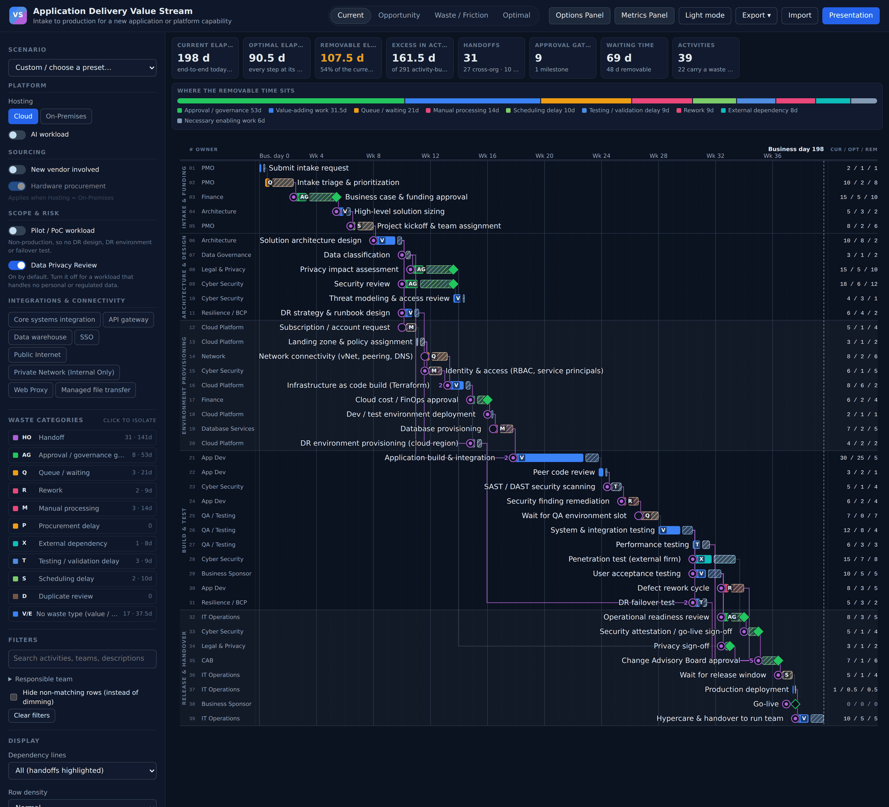
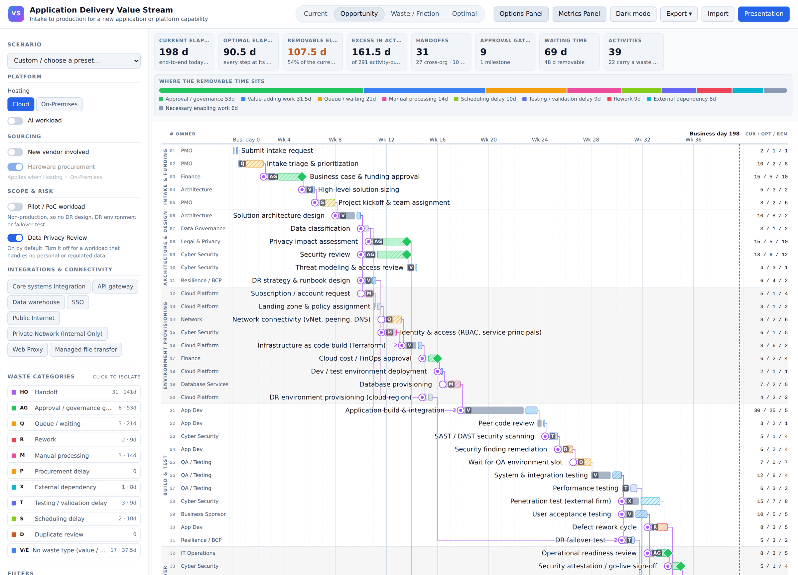
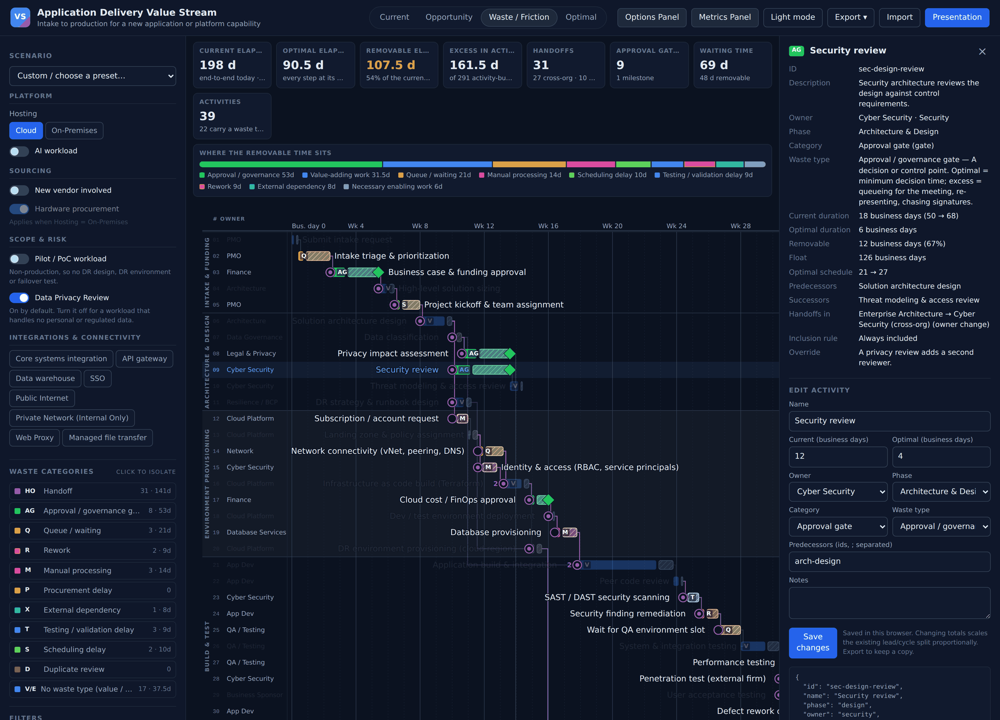
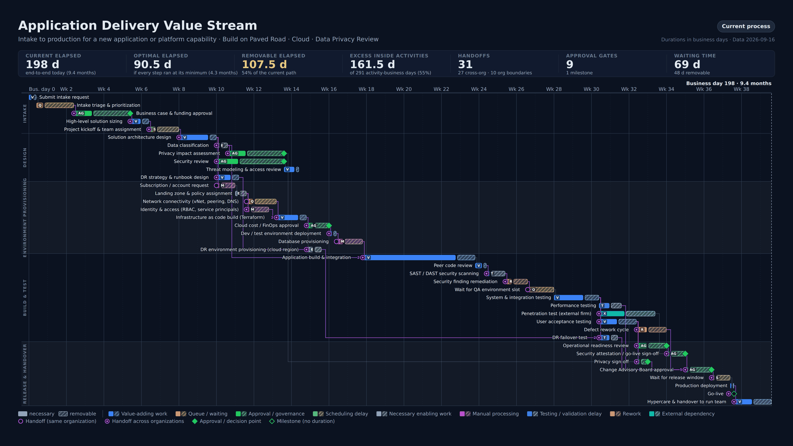

# Flowline

**See where the time goes. Find where you could save it.**

Load your process, turn on the conditions that apply to the work in front of you, and the chart shows how long it takes today, how much of that time is necessary, how much could come out, where work waits, and where it changes hands.

It runs as a single HTML file with no server, no build and no network. The repository also includes an example [Backstage](https://backstage.io) frontend plugin so the same chart can live in a developer portal, though it has not yet been run inside a real Backstage build. See [BACKSTAGE.md](BACKSTAGE.md).



## What it does

Every activity carries two numbers you supply: how long it takes now, and your estimate of the minimum if nothing went wrong and nobody waited. Flowline schedules both and draws the difference as a hatched segment on the same bar.

The output is only as good as those estimates. What the tool adds is the scheduling: it follows your dependencies, so a saving on a step running in parallel with a longer one does not shorten anything.

In the sample data above, the current schedule runs 198 days. Using the entered minimums it models 90.5 days, a difference of 107.5 days on the critical path, which is the chain of dependent activities that sets the end date. The same process carries 31 handoffs, 27 of them crossing an organizational boundary. That last number is usually the story.

The metrics panel also reports the sum of time inside activities. That answers a different question: total effort rather than elapsed time. For a purely sequential process the two are equal. The more parallelism, the further apart they drift, and it is worth knowing which one you are quoting.

## Quick start

```bash
git clone https://github.com/mrobinson2/flowline.git
cd flowline
open index.html          # or xdg-open, or drag it into a browser
```

No install, no server. It opens with sample data. If you would rather not clone, use **Code → Download ZIP**, extract, and open `index.html`.

For one file you can email or drop on a share:

```bash
node tools/bundle.js     # writes dist/flowline.html with everything inlined
```

## Four views of the same schedule

| View | Question it answers |
|---|---|
| **Current** | How long does this take today, and what is it waiting on? |
| **Opportunity** | Where is the removable time, ignoring the work that has to happen? |
| **Waste / Friction** | Which steps are queues, rework, manual handling or approval drag? |
| **Optimal** | What would the schedule look like at your minimum durations? |



Click any bar for the full detail, including an inline edit form for changing a number live in a meeting. The Waste / Friction view dims value-adding work so the friction stands out.



## Presentation mode

Press **Presentation** for a fixed 1920x1080 composition: title, scenario summary, metrics strip, timeline, legend. Row height, bar height, fonts and margins are all computed from the row count, so 30 activities get generous bars and 80 still fit one slide without CSS scaling. Text stays vector-crisp.



Every export (PNG at 1920x1080 or 3840x2160, SVG, or copy to clipboard) uses this same composition even when you trigger it from the interactive view, so it drops straight into a deck. Above 80 visible rows the toolbar says so, because a truncated chart that does not admit it is a chart that lies.

## Reading the chart

Nothing relies on color alone. Every family carries a text code, removable time is always hatched, and handoffs and gates have their own shapes.

* **Stacked bar.** Solid segment is the necessary time, hatched segment is the removable time. Total length is the current duration.
* **Color family** is the kind of activity or the kind of waste, repeated as a code badge on the bar.
* **Ring at the start of a bar** means the activity receives a handoff, so the owner changed. A filled center dot means it also crosses an organizational boundary. A number beside the ring means several handoffs converge there.
* **Diamond at the end of a bar** is an approval or decision point. A gate can carry duration of its own, so necessary decision time is separated from queueing and chasing signatures.
* **Dependency lines** are thin grey, purple where the link is a handoff.
* **Phase bands** group rows with rotated labels down the left.
* **Side columns** carry the row number, the responsible team, and `current / optimal / removable`, so a bar too small to read still reports its numbers.

Rows are focusable, Enter or Space opens the details panel, and every row carries a spoken-word summary for screen readers.

## Bringing your own data

### Import a spreadsheet

Start with `fixture/sample-value-stream.xlsx` to see the expected columns. Press **Import** and pick an `.xlsx` or `.csv`; Flowline reads the headers, not the file name.

A sheet carrying `ID`, `Task`, `Current Lead Time (hrs)` and `Current Cycle Time (hrs)` is treated as a source workbook and replaces the whole data set: activities, teams, phases, the waste taxonomy and the scenario switches. Anything else merges into the current data as an activities table.

Three things the import assumes about that workbook format, each of which it also reports:

* **Elapsed time is lead plus cycle.** Lead Time is read as waiting only, Cycle Time as hands-on work. **If your spreadsheet already includes working time inside Lead Time, fix it before importing or that time is counted twice.**
* **Each distinct "Applies When" phrase becomes an on/off switch.** Add a phrase in Excel, reload, and a new control appears.
* **Assigned Team is the owner, Team Topologies Type is the organizational boundary.** Those are data-mapping choices for this workbook, not universal definitions. Change them in `js/schema.js`.

Values outside a known picklist are kept, counted and listed in the panel, never silently dropped. Unknown columns are reported and ignored.

The `.xlsx` reading and writing is done by the app with no libraries. `.xlsx` is zipped XML, and the browser's `DecompressionStream` inflates the parts Excel compresses.

If the workbook carries its own CPM columns, Flowline keeps them and compares them against its own forward pass, listing any differences. Two independent passes over the same graph is a cheap bug detector for both sides.

### Link the data folder

Click **Link data folder** and pick the app folder or its `data` folder. After that, edit `data/process.data.js` in your editor, save, click **Reload**, and the chart updates. Or edit in the app and click **Save** to write the files back. Your browser may ask permission to read and write the folder, and may ask again after a restart. Chrome and Edge support this; Firefox and Safari fall back to Import and Export, which work everywhere.

### Edit the files directly

The three files in `data/` are JSON inside a one-line wrapper:

```js
VSM.register("process", {
  "title": "Application Delivery Value Stream",
  "units": "business days",
  "activities": [ ... ]
});
```

The wrapper exists because browsers refuse `fetch()` of a local file opened from disk, while `<script src>` works everywhere. The same files work unchanged hosted as a static site.

**Import** also takes `.json`, and you can drop any supported file on the page. It accepts a process file, a taxonomy file, a scenario file, or a bundle of all three. Imported data stays in the browser until you press **Discard loaded data**, and **Export ▾ → JSON bundle** writes it back out.

## Scenario tailoring

A value stream is not one process. An off-the-shelf SaaS purchase and a greenfield build pioneering three new services do not go through the same steps, and averaging them describes neither.

Flowline models that as one **profile** (a saved set of options for a type of work) plus any number of **modifiers** (individual options such as whether it involves AI or regulated data). A profile declares values for some toggles and stays silent on the rest, so switching profile leaves a modifier it never mentioned exactly where you put it.

The model is recomputed from the whole current state every time rather than mutated step by step, so profile-then-modifier gives the identical answer to the other order. A test asserts it.

Conditions are declarative and can be named once and reused:

```json
"rules": {
  "sensitiveData": { "dataClassification": { "in": ["confidential", "restricted"] } },
  "deepSecurity":  { "all": ["securityReview", "sensitiveData"] }
}
```

```json
{ "id": "threat-model", "when": "deepSecurity", "duration": { "current": 4, "optimal": 3 } }
```

Toggles do not only add and remove steps, they change how long a step takes. A Scenario Matrix cell holding a number both requires the task and multiplies its duration, because an architecture review for a catalog pattern is not the review a greenfield build gets.

Where one toggle requires a step and another excludes it, required wins and the collision is reported by name. A governance tool that can silently drop a control because two toggles disagreed will eventually embarrass somebody.

## Embedding it elsewhere

`js/embed.js` mounts the chart into any element with no application chrome:

```js
const chart = VSM.embed.create(document.querySelector("#chart"), {
  data: { process, taxonomy, scenario },   // omit to use the shipped data
  profile: "build-paved",
  view: "current",
  theme: "dark",
  onSelect: (activity, node) => console.log(activity.id, node.duration)
});

chart.update({ view: "waste" });   // redraw; unspecified options keep their value
chart.setData(next);               // swap the data set, e.g. after an import
chart.destroy();
```

`create()` and `setData()` run the same validation the app uses and throw with the first error rather than leaving you an empty box. `examples/embedded.html` is a working page. The full options and methods reference is in [BACKSTAGE.md](BACKSTAGE.md).

## Validation

Data is checked before anything is drawn, and errors name the activity and say what to fix:

```
activity #6 (vendor-rfp) inclusion rule: unknown scenario attribute 'hostng'.
  Without this check the activity would silently never appear.
activity #8 (vendor-contract): optimal duration (9) is larger than current (2).
dependency loop: intake -> sizing -> biz-case -> intake-triage -> intake.
```

This matters most for rules. A misspelled attribute used to evaluate quietly to false, so the activity just vanished from the chart with nothing to explain it.

When a load fails validation the previous chart stays on screen and the errors are listed in the sidebar, so a typo during a workshop never blanks the projector.

## Running the numbers without a browser

```bash
node test/run-tests.js                                # arithmetic, against the fixture
node test/regressions.js                              # security and correctness regressions
IMPORT_FILE=/path/to/real.xlsx node test/run-tests.js # point it at your own workbook
ONLY="quadratic" node test/regressions.js             # run one regression group
```

`js/node.js` loads the whole engine under plain Node with no DOM. Only the renderer needs a browser. Node 18 or newer.

Point it at a real workbook and it reports the totals, the values outside the picklists, and how summed activity time compares with the critical path. Every security and correctness fix gets a regression group, each checked to fail before it was checked to pass. See [CHANGELOG.md](CHANGELOG.md).

## Layout

```
index.html        the app shell            data/       process, taxonomy, scenario
css/app.css       application chrome       examples/   embed demo, Backstage plugin
js/               the engine (see below)   test/       run-tests.js, regressions.js
tools/bundle.js   builds dist/             fixture/    a synthetic source workbook
```

Inside `js/`, dependencies run one way: `registry` → `rules` → `schedule` → `layout` → `render` → `app`, with `schema` and `validate` describing the data, `table` and `import` reading workbooks, `files` handling the linked folder, `embed` mounting the chart elsewhere, and `node.js` loading everything without a DOM.

`js/schema.js` is the file to edit when a column name changes: it declares every column, its aliases and its picklist, and the importer, validator and exporter all read from it.

The renderer is a custom SVG timeline rather than a Gantt library. Date-based libraries have no concept of stacked segments, gate diamonds, handoff markers or presentation sizing, so wrapping one meant fighting it at every step. It is about 500 lines with no dependencies, and the SVG it produces is the export.

## Browser support and data handling

| Feature | Support |
|---|---|
| The chart, CSV import, PNG and SVG export | Any current browser |
| Copy to clipboard as PNG | Needs the clipboard image API; reports an error where it is missing, so use PNG export instead |
| `.xlsx` import | Chrome/Edge 103+, Safari 16.4+, Firefox 113+ (`DecompressionStream`) |
| Link data folder | Chrome and Edge (File System Access API) |

The standalone app reads imported files in your browser and does not upload them anywhere. Clipboard export and folder access depend on browser support and permissions.

If you embed Flowline in another application, check that application's security policy and data handling. The bundled `dist/flowline.html` inlines its scripts and styles, and the renderer writes inline style attributes so the exported SVG keeps its appearance, so a host page with a strict Content Security Policy will need to account for that.

## Contributing

Run both suites before opening a pull request. CI runs them on every push along with a check that the standalone build still builds.

```bash
node test/run-tests.js && node test/regressions.js && node tools/bundle.js
```

If you are fixing a defect, add a regression group for it in `test/regressions.js` and check that it fails against the code before your fix.

## License

MIT. See [LICENSE](LICENSE).
