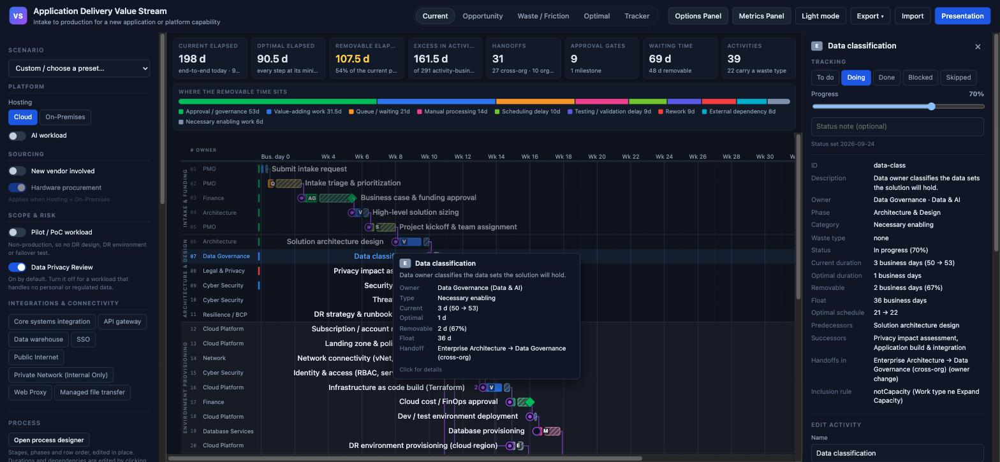
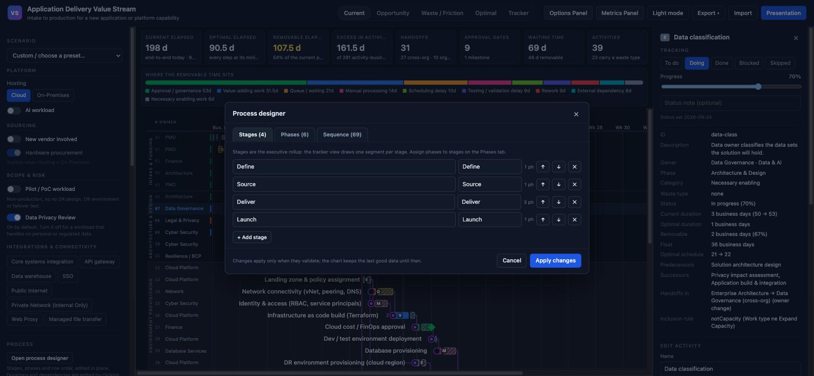
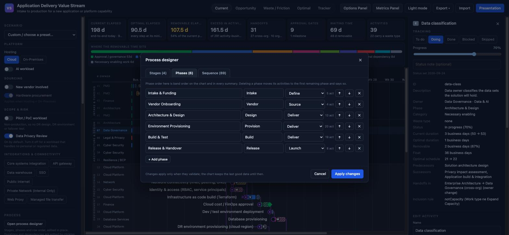
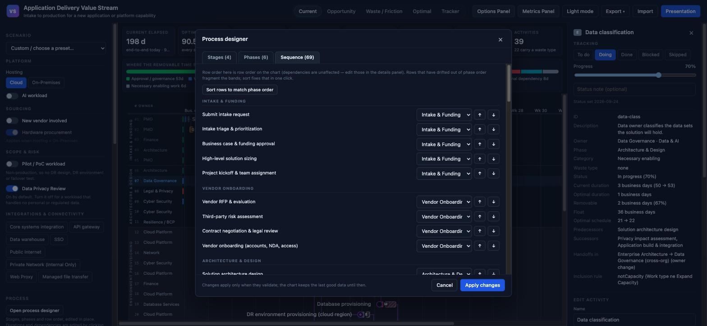
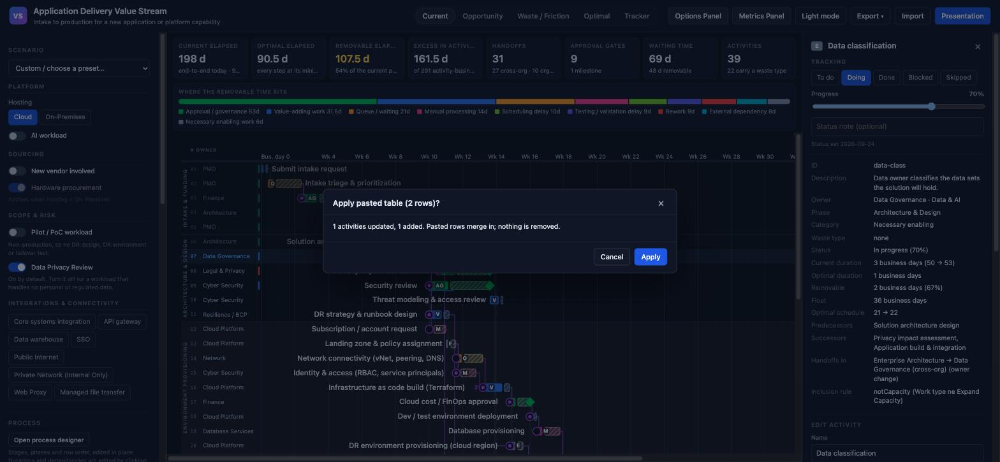
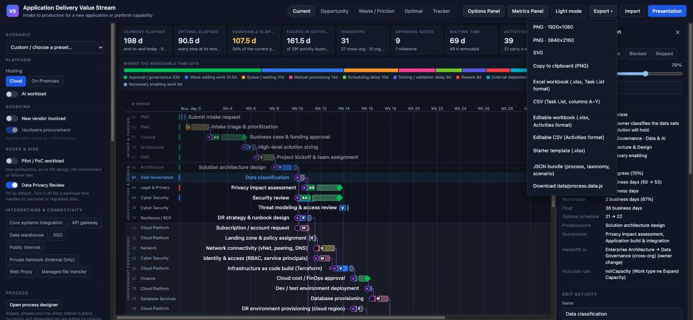

# The tools around the chart

Companion to [UI-VIEWS.md](UI-VIEWS.md), which shows the five views. This
page shows the panels and dialogs: the details panel with status tracking,
the process designer, and the import/export machinery. Same data set and the
same tracked moment throughout, so the numbers agree with the views page.

## The sidebar

Visible on the left of every full-app screenshot on the views page, top to
bottom:

* **Scenario** — the preset dropdown plus the workload facts (hosting, AI,
  vendor, hardware, lifecycle stage, the data involved, service tier,
  pattern conformance, integrations). Flip an answer and the chart, metrics
  and tracker recompute immediately. A toggle another toggle forces on says
  so; a toggle that does not apply says when it would.
* **Derived by the engine** — chips for the values nobody is asked: the
  architecture route, the selection route, whether DR or a privacy review is
  required. Each cites the answers that produced it, and can be overridden
  with a recorded reason.
* **Process** — opens the process designer (below).
* **Waste categories** — one chip per category with its count and removable
  days; click to isolate that category on the chart.
* **Filters** — free-text search, responsible-team checkboxes, and the choice
  between dimming and hiding non-matching rows.
* **Display** — dependency-line mode, row density, zoom, phase bands, the
  side columns, critical-path underline, and what appears on exported slides.
* **Data source** — where the data came from (shipped files, an import, or a
  linked folder) and the buttons to link, reload, save and discard.

## Details panel and status tracking

Click any row — on the timeline or in a tracker panel — and the details panel
opens on the right:

Top to bottom: the **Tracking** block (one click sets To do / Doing / Done /
Blocked / Skipped; Doing reveals a progress slider; a note field carries the
blocked reason; the date the status was last set is shown), then the full
facts — owner, phase, durations, float, schedule, predecessors, successors,
handoffs and the inclusion rule that put the row in this scenario — then the
inline **edit form** for changing names, durations, owner, phase,
predecessors and notes live in a meeting. The floating tooltip in the
screenshot is the hover summary every row carries.

Every change persists in the browser through the same validation gate as an
import, and lands in every export.

## Process designer

**Open process designer** in the sidebar. Three tabs, one working copy,
nothing applies until the whole result validates.

**Stages** — the executive rollup the tracker segments by. Add, rename,
reorder, delete; the count shows how many phases each stage carries:

**Phases** — label, short name for the rotated band, the stage each phase
rolls into, and the activity count. Phase order here is band order on the
chart. Deleting a phase that still has activities moves them to the first
remaining phase and says so:

**Sequence** — every activity in chart order, grouped under its phase: move
rows up and down, move an activity to another phase, or sort all rows into
band order in one click. Dependencies are deliberately not edited here —
that stays in the details panel where the predecessor list lives:

## Import, paste, and the preview

Import takes `.xlsx`, `.csv` and `.json` — picked, dropped on the page, or
**pasted straight from Excel**. Every import shows what it is about to do
before it does it:

This one is a paste: two rows copied out of a spreadsheet. The dialog states
the paste rule — pasted rows update and add, **nothing is removed** — because
the point of a paste is carrying a few rows out of a bigger sheet. An
imported *file* is authoritative instead: its rows update, add and remove to
match. Warnings (unknown values, missing references) are listed right here,
and remain in the sidebar for as long as the imported data is loaded.

## Export menu

Three groups:

* **Images** — PNG at 1920×1080 or 3840×2160, SVG, copy to clipboard. All
  use the presentation composition of whichever view is active.
* **Spreadsheets** — the Task List format (columns A–Y plus the Stage rollup,
  with Edges, summaries, Teams, Chart View and a Tracking sheet when statuses
  exist), and the **editable Activities format** that Import accepts straight
  back, plus a starter template for beginning from a blank sheet.
* **Data files** — the JSON bundle and `process.data.js`, for putting the
  current state back into the repository or a linked folder.
