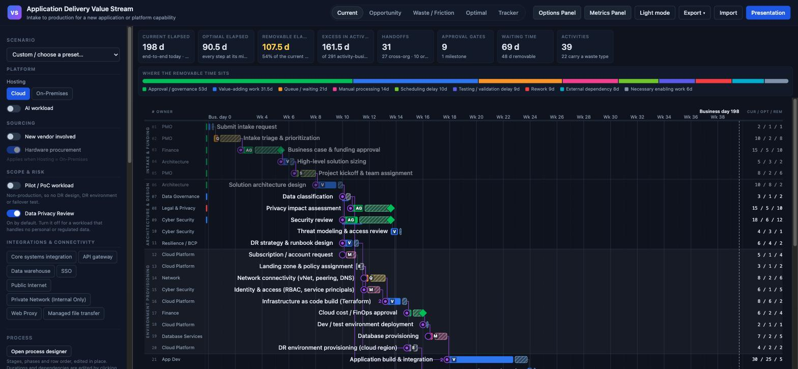
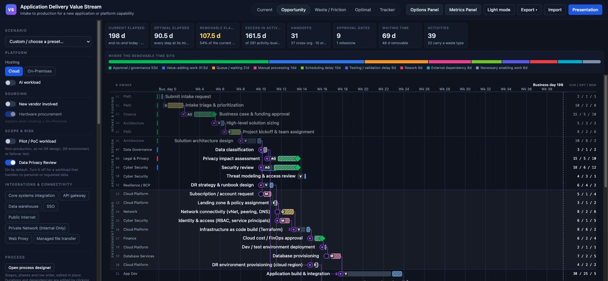
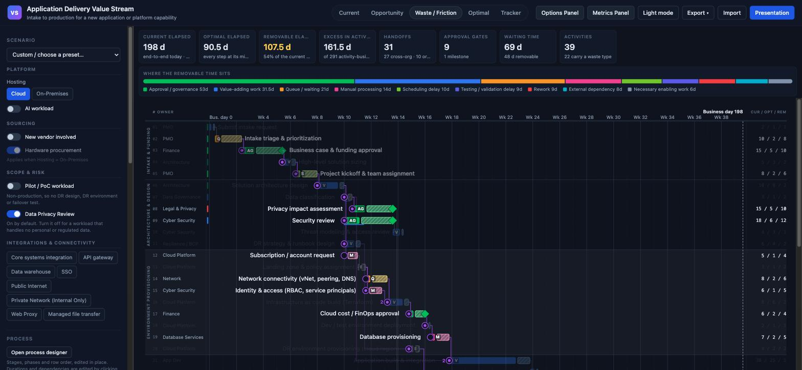
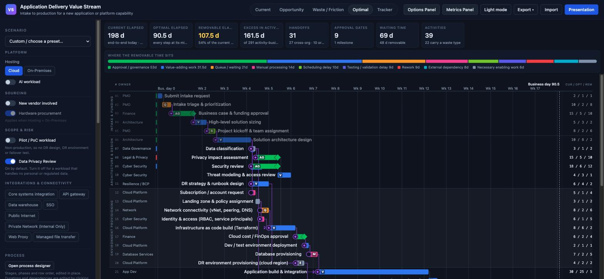
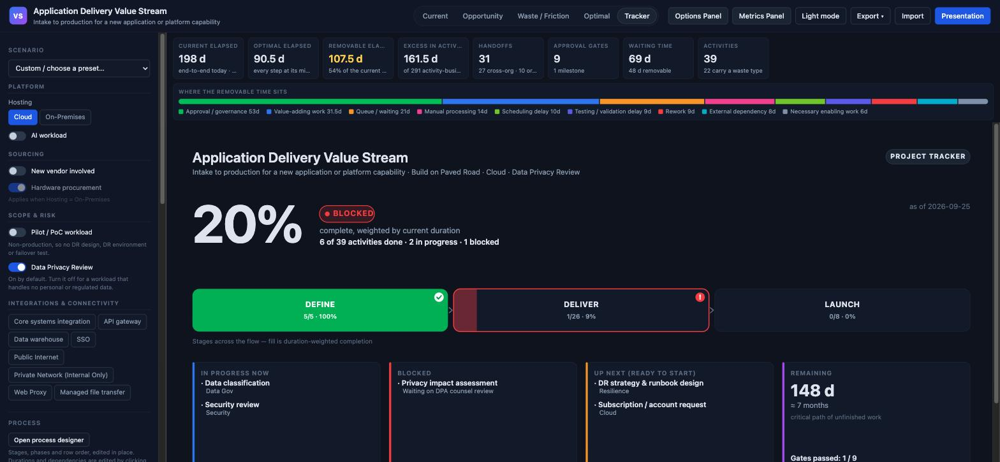
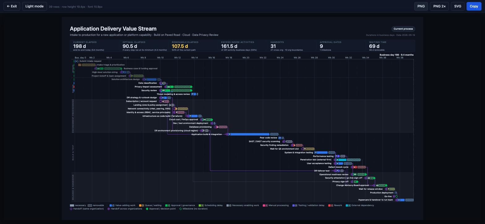
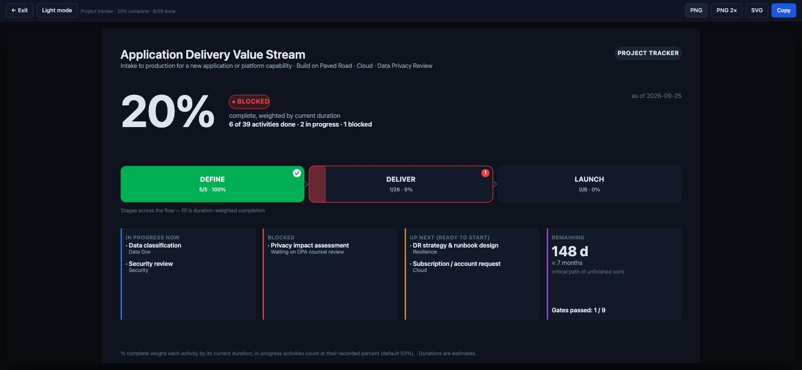
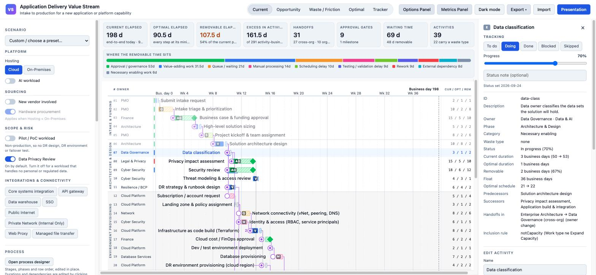
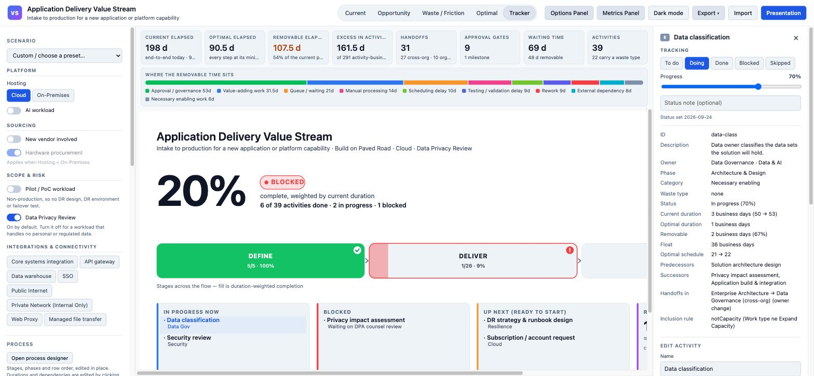

# The five views

Every screenshot on this page shows the same data and the same moment: the
shipped sample value stream (39 activities in the current scenario, 198
business days end to end), tracked mid-project — the Intake phase and the
architecture design done, two activities in progress, one blocked. Only the
view changes, so the numbers agree from picture to picture.

The view buttons are in the top bar. Dark theme unless said otherwise; every
view exists in both themes (see the end of this page).

## Current

*How long does this take today, and what is it waiting on?*

The stacked bars are the heart of it: the solid segment is necessary time,
the hatched segment is removable time, total length is today's duration.
Rings mark handoffs (a filled center dot means the handoff crosses an
organizational boundary), diamonds mark approval gates, and the letter badge
on each bar says what kind of work it is so color is never the only signal.

Because this project is being tracked, each row also carries a status tick in
the gutter left of the plot — green done, blue in progress, red blocked — and
finished rows step back visually. The three columns on the right report
`current / optimal / removable` for every row.

## Opportunity

*Where is the removable time, ignoring the work that has to happen?*

The same schedule with the necessary time greyed out, so the eye lands only
on what could come out. The removable segments keep their category colors —
approval drag reads green, queues amber, rework red — which is what makes
this the view for deciding where to aim first.

## Waste / Friction

*Which steps are queues, rework, manual handling or approval drag?*

Value-adding work is dimmed; only the friction stays lit. The waste-category
chips in the sidebar isolate one category at a time (click to isolate, click
again to clear), and the handoff rings stay at full strength because handoffs
are counted from the structure, not from a tag.

## Optimal

*What would the schedule look like at your minimum durations?*

The whole graph rescheduled with every activity at its optimal duration —
here 90.5 days against the current 198. Activities whose optimal is zero
(a queue that on-demand environments would remove entirely) collapse to a
dashed marker. The axis rescales; the dependency logic is identical.

## Tracker

*Where is this project right now, what is stuck, and how much is left?*

The 1.1 addition, and the one view built for someone who is not going to
study a Gantt: a headline percent (weighted by current duration), a health
pill, one delivery-tracker segment per stage — done segments solid with a
check, the active one part-filled, blocked ones flagged red — then the four
panels a status meeting actually asks for: what is in progress and who owns
it, what is blocked and why, what is ready to start, and the remaining time
computed as the critical path of unfinished work. Every list item is
clickable and opens the same details panel as a timeline row.

## Presentation mode

Any view exports as a fixed 1920×1080 composition — title, scenario summary,
metrics strip, chart, legend — sized from the row count so it drops straight
into a deck. PNG (1× or 2×), SVG, and copy-to-clipboard all use this
composition even when triggered from the interactive view.

The timeline composition:

And the tracker composition — the slide for the exec readout:

## Light theme

One button, applies everywhere including exports.

---

The panels around the chart — the sidebar, the details panel with status
tracking, the process designer and the import/export tools — are on the
companion page: [UI-TOOLS.md](UI-TOOLS.md).
